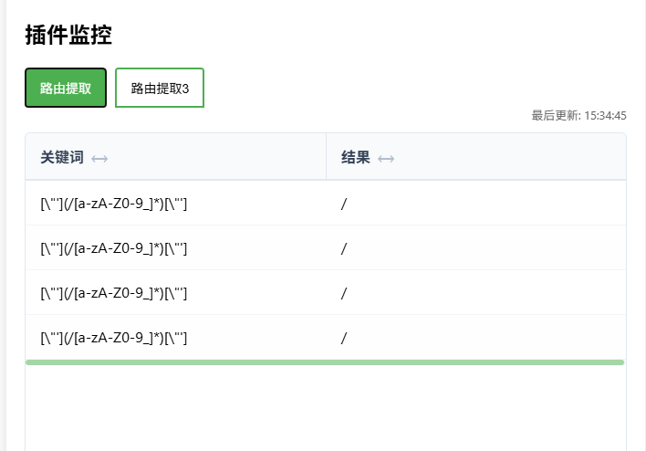
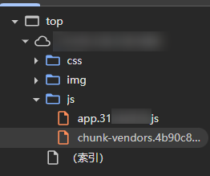
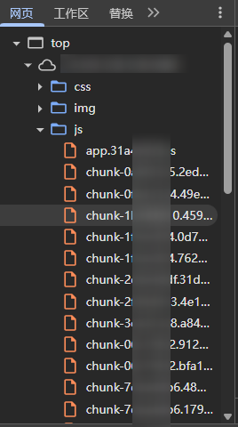
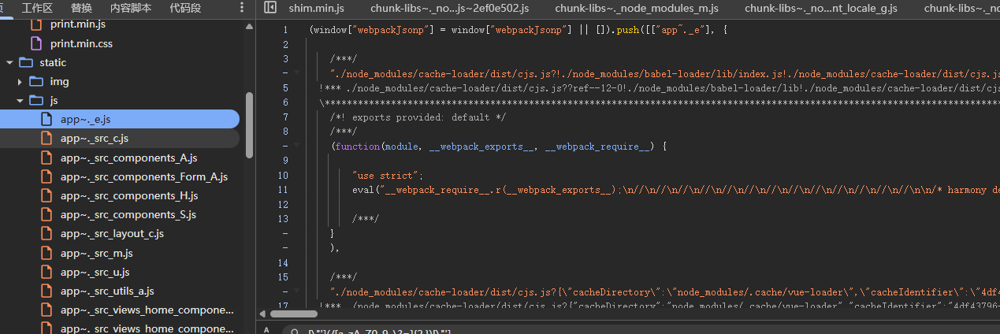
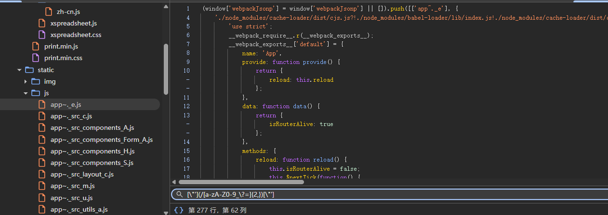

# mitmproxySecurityScripts: mSS-GUI a mitm based cyber security tool


基于mitmproxy的安全工具。

## 当前支持功能

| 功能 | 节 | 版本 |
|--------|------|--------|
| 关键词加解密 | 2.1 | 0.0.1 |
| 包修改与关键词查询 | 2.2 | 0.0.3 |
| UA编辑，微信请求包DROP | 2.3 | 0.0.5 |
| GUI | 2.4 | 0.1.0 |
| webpack-提取打包器js | 2.5 | 0.1.0 |
| cors解限制（https网站强制httpsjs加载） | 2.3 | 0.1.4 |
| webpack-优化未提升作用域下的代码 | 2.5 | 0.1.4 |
| 插入js代码 | 2.6 | 0.1.5 |
| webpack-去除routerguard | 2.5 | 0.2.1 |

## 0 为什么使用mitmproxy（mitmdump）
1. 安装方便，使用`pip install mitmproxy`即可

2. 可移植性高，一次加解密可以在各种工具（bp、sqlmap、以及其他支持代理的利用工具）上使用，达到无感加解密，同理各种敏感路径提取也可以整合起来不用面对google变幻的规则。如工具本身不支持使用代理，考虑使用proxifier。

3. BP插件写着太烦人了^ ^

## 1 使用方式
首先在run.py中添加要加载的函数（类）并设置参数。

然后在terminal中启动mitmdump。其中，mitm可以以以下两种形式启动（还有更多方式，请见mitmproxy的文档）：

①只监听，可用于各种流量工具的自动加解密如burpsuite、sqlmap tamper，或自定义包格式等，如果做自动加解密建议使用explorer->bp->mitm形式。
`mitmdump -s [mitm.py] -p [port]` 

②做中转代理，如sqlmap->mitm->burpsuite
`mitmdump -s [mitm.py] -p [in-port] --mode upstream:http://localhost:[out-port]`

注：出现证书问题（如自签名证书、证书过期）可以对mitm使用--ssl-insecure。

### 1.1 GUI

本工具支持GUI页面（需要启用插件Ctx_gui），安全起见工具启动时会生成一个token，你也可以在settings里自定义一个固定的token。


可以通过访问mss.local/console.mss来使用GUI界面:


由于mitmdump本身输出比较繁杂，组件的输出不但会在终端输出中显示，也会在GUI控制台中显示以便查询。部分继承GUI类的组件在启动时也会在GUI界面注册面板以自定义输出（插件配置请在run.py中修改，这个文件是**热加载**的，所以修改后无需重启即可生效）。

同时，也可以在控制台中自由修改全局配置。

### 1.2 使用示例-加密功能

具体请参照2.1节加解密。

假设网站存在响应包加密DES、模式CBC、密钥为A，偏移为B，输出格式HEX，我们想在BP里看到响应明文。

先修改run.py，选择模块Ctx_decrypt。

``` python
Ctx_decrypt(
    ':"([^"]*)"', #假设响应包格式为{"data":"ADIOJOICVDJVDLS"}，则需要匹配的密文正则表达式为`:"([^"]*)"`。
    [RR.RESPONSE], #又由于我们只解密响应包，模块的目标为[RR.RESPONSE]。
    ALGO.DES, #DES加密
    AES.MODE_CBC, #CBC模式
    A, #密钥
    CODE.BASE64, #输入格式
    'utf-8', #编码格式（影响输出中文编码等）
    B, #偏移
)
```

写完Ctx_decrypt之后，将其加入run.py中的addons数组。

然后使用`mitmdump -s run.py -p [port]`运行，在bp中设置顶级代理=http://localhost:[port]即可，也就是这里：


此时，代理响应从服务器发出，先经过mitmproxy，再传回bp，此时响应包中data对应的值已被解密。

## 2 脚本介绍

### 2.0 基类

#### Ctx_global
- rr[list,enum] 可取值RR.REQUEST（请求）和RR.RESPONSE（响应），表示当前模块是否对请求、响应生效，如[RR.REQUEST,RR.RESPONSE]。
**不受全局变量影响，对所有请求/响应包生效。**

#### Ctx_base
- rr[list,enum] 可取值RR.REQUEST（请求）和RR.RESPONSE（响应），表示当前模块是否对请求、响应生效，如[RR.REQUEST,RR.RESPONSE]。

#### Ctx_hit_base < Ctx_base
- regex[str] 捕获表达式，这个类**仅捕获请求体和响应体**。需要注意的是对请求体`a=1`，表达式`a=[0-9]*`捕获`a=1`，表达式`a=([0-9]*)`捕获1。

#### mi_gui.GUI < ABC
- showname[str] 可选，为在页面中显式的插件名，可通过自定义插件名以区分同时启用的多个插件

### 2.1 加解密

#### mi_crypt.Ctx_encrypt/Ctx_decrypt < Ctx_hit_base
包括Ctx_encrypt（加密）和Ctx_decrypt（解密），目前支持的算法为AES/DES/RSA/SM4。使用前请记得安装依赖。
**可以与burpsuite联动以实现无感请求包解密。**
- algo[enum] 可取值为ALGO.DES/ALGO.AES/ALGO.RSA/ALGO.SM4...表示加解密使用的算法。
- mode[Crypt] 加密模式，如AES.CBC。
- key[byte] 密钥，如'1234567887654321'.encode('utf-8')
- output[enum] 可取值为CODE.BASE64/CODE.HEX，加密的输出格式或解密的输入格式。
- encoding[str] 编码格式，默认值为utf-8。
- iv[str|byte] 一般情况下为偏移量，格式参考key。在RSA解密模式，为私钥的password，str格式。
``` python
Ctx_encrypt(
    "a=([0-9]*)",
    [RR.REQUEST],
    ALGO.AES,
    AES.MODE_CBC,
    '1234567887654321'.encode('utf-8'),
    CODE.BASE64,
    'utf-8',
    '1234567887654321'.encode('utf-8')
)

Ctx_encrypt(regex,rr,algo,mode,key,[output,encoding,iv])
```
#### mi_code.Ctx_code < Ctx_hit_base
目前支持base64和hex的编码解码。
- ft[enum] 可取值为FT.FROM/FT.TO，分别对应解码/编码。
- code[enum] 可取值为CODE.BASE64/CODE.HEX，指示编码格式。
``` python
Ctx_code(
    "a=([0-9]*)",
    [RR.REQUEST],
    FT.FROM,
    CODE.BASE64
)

Ctx_code(regex,rr,ft,code)
```

### 2.2 请求头、请求体的modify

#### mi_modify.Ctx_head < Ctx_base
可以对请求和响应中的head进行增、删、改、打印（这里可以通过修改源码扩展内容）。如果要一次性修改多个头，建议使用多个Ctx_head实例。
- s1[str] 需要进行修改的头
- curd[enum] 可取值为CURD.ADD/CURD.DELETE/DURD.REPLACE，指示对应增删改查操作。
- s2[str] 可选，需要修改的值，当操作为删除时可不写。
``` python
Ctx_head(
    [RR.REQUEST],
    "Authorization",
    CURD.ADD,
    "Bearer 55yL5ZWl5ZGiXiBe",
)

Ctx_head(rr,s1,curd,s2="")
```

#### mi_modify.Ctx_content < Ctx_base
可以对请求和响应中的body进行增、删、改、打印（这里可以通过修改源码扩展内容）。如果要一次性修改多处内容，建议使用多个Ctx_content实例。
- s1[str] 需要进行修改的值
- curd[enum] 可取值为CURD.DELETE/DURD.REPLACE，指示对应增删改查操作。
- s2[str] 可选，需要修改的目的值，当操作为删除时可不写。
``` python
Ctx_content(
    [RR.REQUEST],
    "user_id=1",
    CURD.REPLACE,
    "user_id=19",
)

Ctx_content(rr,s1,curd,s2="")
```

#### mi_modify.Ctx_all < Ctx_base
Ctx_content+Ctx_head，简化操作使用此类。
- s1[str] 需要进行修改的值
- curd[enum] 可取值为CURD.DELETE/DURD.REPLACE，指示对应增删改查操作。
- s2[str] 可选，需要修改的目的值，当操作为删除时可不写。
``` python
Ctx_all(
    [RR.REQUEST],
    "10000001",
    CURD.REPLACE,
    "10000003",
)

Ctx_all(rr,s1,curd,s2="")
```

### 2.3 流量优化

#### mi_notrace.Ctx_drop_wechat301 < Ctx_base
自动drop请求微信登录的包。一般在“用浏览器打开微信公众号链接”时用到。
无参。
``` python
Ctx_drop_wechat301(
)

Ctx_drop_wechat301(rr=[RR.REQUEST])
```

#### mi_notrace.Ctx_ua < Ctx_global
修改请求使用的User-Agent。目前有手机、爬虫、微信小程序三个UA。
- ua[UA] 可取值为UA.PHONE/UA.SPIDER/UA.WXMINIPROGRAM
``` python
Ctx_ua(
    UA.PHONE
)

Ctx_ua(ua)
```

#### mi_notrace.Ctx_cors < Ctx_global
无参插件。让属于https网站的http的包走https协议，并放宽网站的CORS限制，以使得网站中其它资源尽情加载。

#### mi_notrace.Ctx_drop < Ctx_global
自动killurl中带有关键词的包。
- hint[list] 为**正则表达式**列表，当任意一个正则表达式匹配到URL时丢包，如"4399\.com.*report$"匹配[http://www.4399.com/123/report]()。
``` python
Ctx_drop(
    ["report","aegis.qq.com"]
)

Ctx_drop(hint)
```

### 2.4 GUI

带有GUI界面的插件。

#### mi_gui.Ctx_GUI
无参插件，GUI插件。

启用时，请通过访问mss.local/console.mss来使用GUI界面。详见节#1.1。

**请注意，请在其它继承GUI类的插件后调用此插件，否则插件无法正常初始化。**

#### mi_modify.Ctx_rlookup < Ctx_base, GUI
**这个类会在GUI界面展示捕获值，点击行和列以复制结果。**



针对请求体和响应体的正则查找类。
- reg[list] 使用的正则捕获组列表
``` python
Ctx_all(
    [RR.REQUEST],
    ["([0-9]{1,3}\.[0-9]{1,3}\.[0-9]{1,3}\.[0-9]{1,3})"] # 捕获IP
    "捕获IP" # showname，请参考基类中GUI的定义
)

Ctx_all(rr,reg,showname="RLOOKUP")
```

#### mi_webpack.Ctx_webapi < Ctx_base, GUI


### 2.5 webpack

处理webpack类网站插件。

#### mi_webpack.Ctx_forcejs
无参插件，自动提取加载webpack中的js文件，可配合Ctx_rlookup以快速提取API。**在已经加载过的网站使用前请清除缓存。**

使用插件前：



使用插件后：



#### mi_webpack.Ctx_packeaziler
无参插件，优化未提升作用域下的代码（eval-source-map）。**注：在控制台可以提取webpack://的时候不需要开启此插件**

使用插件前：



使用插件后：



#### mi_webpack.Ctx_antiguard
清除路由guard，也就是vue前端的鉴权。

使用插件前：


使用插件后：


- antiroute[list] 可选，指示需要去掉的路由位置（如未登陆强制跳转到login，此处填写["login"]会将所有next(".\*login.\*")置空），如果不填写会置空所有guard。
``` python
Ctx_antiguard(
    ["login","index"] # 要绕过的guard 或不填
)

Ctx_antiguard(antiroute)
```

#### mi_webpack.Ctx_proxypack
无参插件，导出部分webpack变量到window作用域（全局）下。这个插件主要是给其他插件使用的。

使用插件后：


### 2.6 monkey

请注意，monkey的部分预设脚本和webpack的proxyhook会把一部分变量放在**window.__mss__**下。如果出现未知问题需要排查请参考此条。

向页面注入js脚本的插件。效果如图：


- monkeylist[list[tuple(filename:str, type:MONKEYSCRIPT )]] 使用的脚本文件名和插入方式
``` python
Ctx_monkey(
    [
        (
            "hello.js", # 脚本文件名，默认放在monkey文件夹下
            MONKEYSCRIPT.INNERTAIL # 可取值MONKEYSCRIPT.INNERHEAD/MONKEYSCRIPT.INNERTAIL/MONKEYSCRIPT.OUTSIDE，对应文档开头、文档结尾、额外文件加载（script.src方式）。
        )
    ]
)

Ctx_monkey(monkey)
```

## 3 全局变量

可以在settings.py中设置以下全局变量以控制脚本的全局行为：
- 全局范围[list] 列表，指定脚本生效的domain范围。由于普遍习惯，使用**通配符**而非正则进行匹配。毕竟在正则的情况下*.4399.com就需要写成.*\.4399\.com，感觉稍微有点反人类了。
    - 正向匹配，可以使用如：*.4399.com
    - **如需要反向排除，请在单词最前部分使用感叹号（!）**，如：!\*.4399.com

## -1 更新日志

鉴于项目定位的变更（我想把它从单纯的脚本合集变成简单易用的工具），工具改名为mSS-GUI，原名为mitmproxySecurityScripts。
这个项目会持续更新，如有需求可以向我的github邮箱发送邮件。

由于项目长期处于施工中，每次commit可能会存在部分未完成的代码，这并不影响使用。
脚本的具体使用方法请参考文档。
- 0.0.1 开天辟地，拥有基础功能
- 0.0.2 修复BUG
- 0.0.3 完善文档部分
- 0.0.4 修改文档排版，新增SM4加解密，添加全局变量和头处理
- 0.0.5 增加一些用于流量优化的脚本
- 0.0.6 DEBUG，修复导入问题
- 0.0.7 重构合并了Ctx_head和Ctx_content，新增Ctx_drop
- 0.0.8 新增GUI界面；优化modify模块
- 0.1.0 GUI完成；优化modify模块并为部分插件增加GUI部分。现在可以通过访问mss.local/console.mss来使用GUI界面^ ^~
- 0.1.1 文档捉虫；完善GUI内容，增加Ctx_packeaziler（这里我给一个依赖库提了PR，要等这个依赖库更新才能支持新功能）
- 0.1.4 增加Ctx_packeaziler和Ctx_cors，完成AST支持
- 0.1.5.2（0.1.6） 增加monkey支持
- 0.2.1 增加Ctx_antiguard 完成全部路由守卫破解
